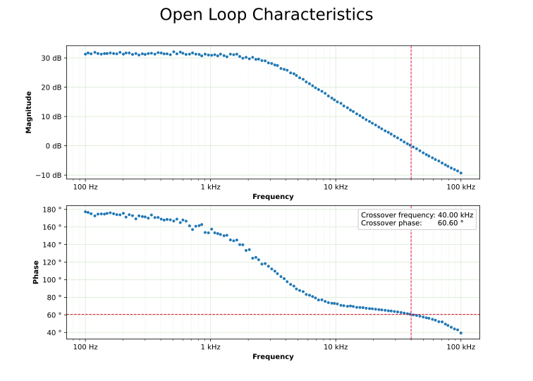
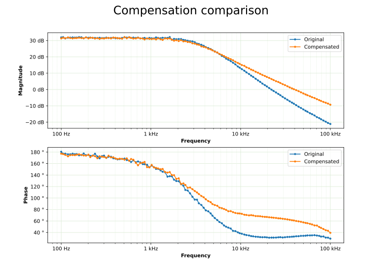

# TF2000 Remote Tools
Remote tools for Voltech TF2000 Frequency Response Analyzer control.
Currently supported features:
* Reading data from the device to a file
* Plotting single or multiple Bode Plots from files
* Marker showing crossover parameters
 
Example plots:



## 1. Installation
The code was written using Python 3.11.4. It is recommended to use a virtual environment to run the scripts:
```
python -m venv .venv
```
To activate the virtual environment run *.venv/Scripts/Activate.ps1*.
To install required packages while the virtual environment is active run:
```
pip install -r requirements.txt
```
The code is formatted using Black:
```
black --line-length 120 .\TF2000_tools.py
```

## 2. RS232 Communication
Crosslinked cable is required to connect TF2000 to the RS232 port of the PC.  
The device uses a somewhat strange DE-9 connector pinout:
* PIN 6 - RX (input)
* PIN 7 - CTS (input)
* PIN 8 - TX (output)
* PIN 9 - RTS (output)
* Rest of the pins - Ground

This requires a custom cable connecting *RX* to *TX* lines and *CTS* to *RTS* lines.

TF2000 needs the following configuration to be able to communicate via RS232:  
PRINT &rarr; Parallel Port >OFF< &rarr; Serial Port >ON< &rarr; Serial Output >Computer< &rarr; Baud Rate >1200<

PC needs the following serial port configuration:
* Baud: 1200
* Data bits: 8
* Parity: None
* Stop bits: 2
* Flow control: RTS/CTR

## 3. TF2000_tools.py

The file contains a simple connector class that allows reading a given number of data lines from the serial port.  
This is useful in the sweep mode, in which data is sent to the PC after every measurement.  
The Class saves received data to the file, prints Bode plots and saves it as a .svg file.
All public class function arguments are documented in the code. See example.py for a quick start.

## 4. TODO
Remote control sweep setup.
